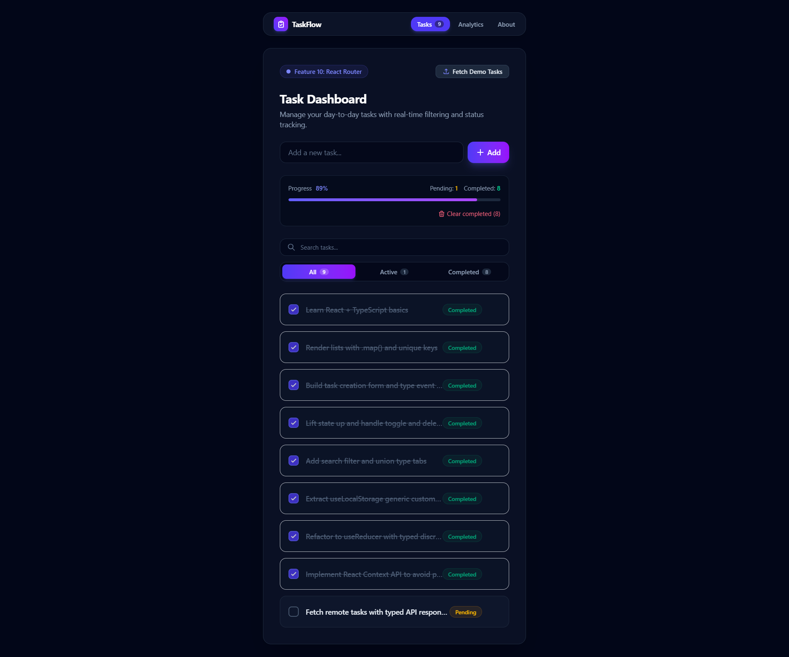
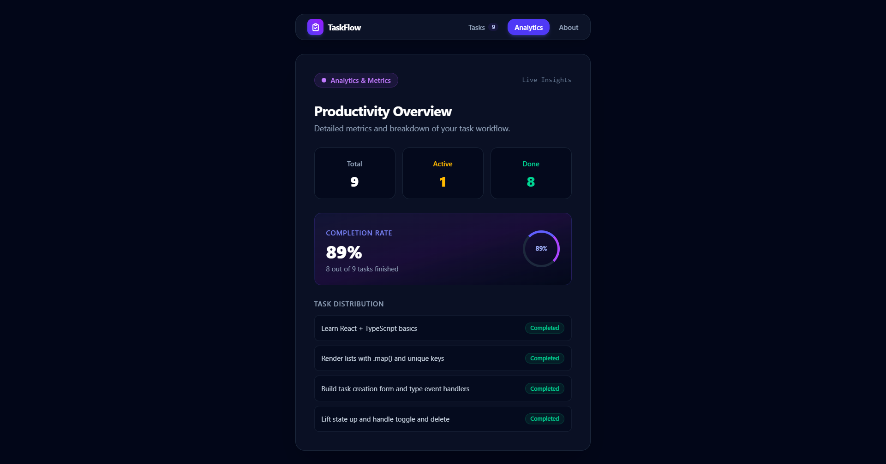

# ⚡ TaskFlow — Modern Task Manager

<div align="center">


**A full-featured, type-safe task management web application built step-by-step with React 19, TypeScript, Tailwind CSS v4, and React Router.**

[🌐 **View Live Demo**](https://chamodi12345.github.io/task-manager-react-ts/) • [Report Bug](https://github.com/chamodi12345/task-manager-react-ts/issues) • [Request Feature](https://github.com/chamodi12345/task-manager-react-ts/issues)

</div>

---

## 📸 Screenshots

<div align="center">

### 1. Task Dashboard & Operations



### 2. Analytics & Productivity Insights



</div>

---

## ✨ Features

- **🛡️ Strict Type Safety**: End-to-end typing with TypeScript interfaces, discriminated unions, and generics.
- **🎨 Tailwind CSS v4 Glassmorphism**: Sleek dark mode design system with gradients, responsive breakpoints, and micro-animations.
- **⚡ Client-Side SPA Routing**: Powered by `react-router-dom` with dedicated pages for **Tasks**, **Analytics**, and **About**.
- **🔄 State Management with `useReducer` & Context API**: Predictable action dispatchers (`TaskAction`) without prop drilling.
- **💾 LocalStorage Sync**: Generic custom hook (`useLocalStorage<T>`) for automatic browser persistence.
- **🔍 Real-Time Filter & Search**: Instant substring filtering and category tabs (`all`, `active`, `completed`).
- **🌐 Asynchronous REST API Integration**: Remote demo data fetching with loading skeleton placeholders and error retry banners.
- **🧪 Comprehensive Test Coverage**: 12 automated unit and component tests with Vitest, Happy-DOM, and React Testing Library.
- **🚀 Automated CI/CD Pipelines**: GitHub Actions for formatting, linting, testing, building, and automated deployment to GitHub Pages.

---

## 🛠️ Tech Stack & Architecture

| Layer         | Technology / Library                                                | Purpose                                 |
| :------------ | :------------------------------------------------------------------ | :-------------------------------------- |
| **Framework** | [React 19](https://react.dev/)                                      | Component architecture & hooks          |
| **Language**  | [TypeScript](https://www.typescriptlang.org/)                       | Type safety & strict contracts          |
| **Styling**   | [Tailwind CSS v4](https://tailwindcss.com/)                         | Utility-first responsive design         |
| **Routing**   | [React Router 7](https://reactrouter.com/)                          | Client-side SPA navigation              |
| **State**     | React Context + `useReducer`                                        | Global predictable state management     |
| **Testing**   | [Vitest](https://vitest.dev/) + [RTL](https://testing-library.com/) | Unit and component testing              |
| **Bundler**   | [Vite 8](https://vite.dev/)                                         | Lightning-fast development & HMR        |
| **CI / CD**   | GitHub Actions                                                      | Automated validation & Pages deployment |

---

## 📂 Project Structure

```text
task-manager-react-ts/
├── .github/
│   └── workflows/
│       ├── ci.yml            # Automated CI pipeline (lint, test, build)
│       └── deploy.yml        # GitHub Pages deployment pipeline
├── screenshots/
│   ├── ss1.png               # Screenshot 1: Task dashboard
│   └── ss2.png               # Screenshot 2: Analytics overview
├── src/
│   ├── components/           # Reusable UI components
│   │   ├── AddTaskForm.tsx   # Controlled form input
│   │   ├── Navbar.tsx        # Navigation bar with active route highlight
│   │   ├── TaskFilter.tsx    # Search input and filter tabs
│   │   ├── TaskItem.tsx      # Single task item with toggle & delete
│   │   ├── TaskList.tsx      # List renderer with empty state handling
│   │   └── TaskStats.tsx     # Progress bar & live metric counters
│   ├── context/              # Context API global state
│   │   ├── TaskContext.ts    # Context type definitions
│   │   └── TaskProvider.tsx  # Provider component
│   ├── hooks/                # Custom React hooks
│   │   ├── useLocalStorage.ts# Generic persistence hook
│   │   └── useTasks.ts       # Type-safe context consumer hook
│   ├── pages/                # Multi-page route views
│   │   ├── AboutPage.tsx     # Project architecture overview
│   │   ├── AnalyticsPage.tsx # Live productivity metrics & charts
│   │   └── TasksPage.tsx     # Main task board
│   ├── reducers/             # Pure reducer & actions
│   │   └── taskReducer.ts    # Discriminated union reducer
│   ├── services/             # External REST API services
│   │   └── taskApi.ts        # Typed fetch client
│   ├── test/                 # Test setup & configuration
│   │   └── setup.ts          # Jest-DOM matchers setup
│   ├── types/                # Core TypeScript interfaces
│   │   └── task.ts           # Task & filter types
│   ├── App.tsx               # Root router & layout
│   ├── index.css             # Tailwind CSS entry
│   └── main.tsx              # Application entry point
├── package.json
├── tsconfig.json
└── vite.config.ts
```

---

## 🚀 Getting Started

### Prerequisites

- [Node.js](https://nodejs.org/) (version 18 or higher)
- [npm](https://www.npmjs.com/)

### Installation

1. **Clone the repository**:

   ```bash
   git clone https://github.com/chamodi12345/task-manager-react-ts.git
   cd task-manager-react-ts
   ```

2. **Install dependencies**:

   ```bash
   npm install
   ```

3. **Start the local development server**:
   ```bash
   npm run dev
   ```
   Open [http://localhost:5173](http://localhost:5173) in your browser.

---

## 🧪 Available Scripts

| Command                | Action                                                |
| :--------------------- | :---------------------------------------------------- |
| `npm run dev`          | Starts Vite local development server with HMR         |
| `npm run build`        | Type-checks with `tsc` and compiles production bundle |
| `npm test`             | Runs all 12 Vitest unit and component tests           |
| `npm run test:watch`   | Starts Vitest in interactive watch mode               |
| `npm run lint`         | Runs fast Oxlint code quality checks                  |
| `npm run format`       | Formats all codebase files with Prettier              |
| `npm run format:check` | Verifies code formatting compliance in CI             |

---

## 📄 License

This project is open source and available under the [MIT License](LICENSE).
